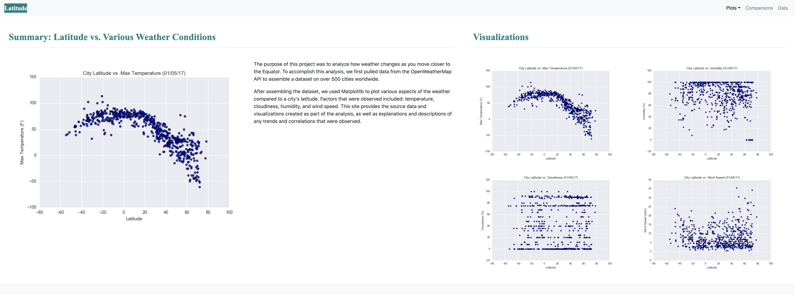
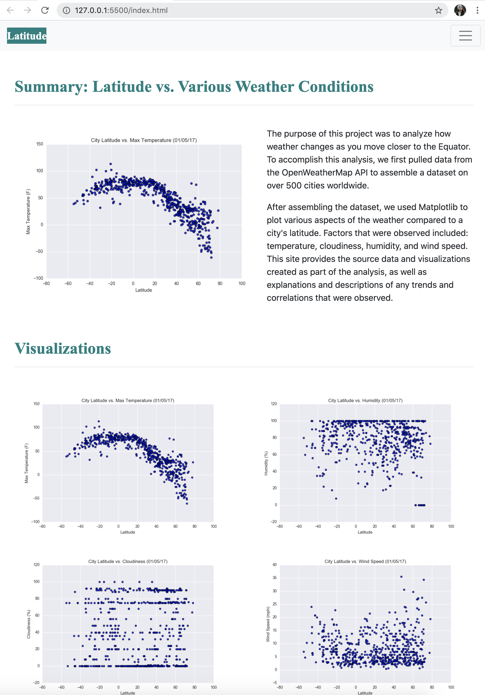
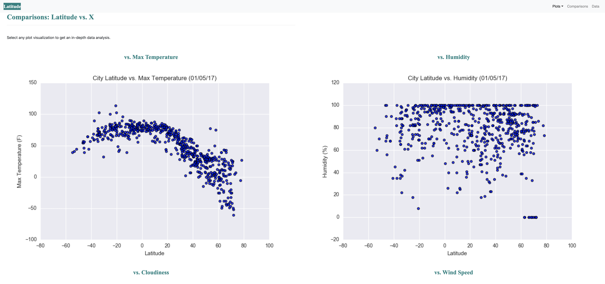
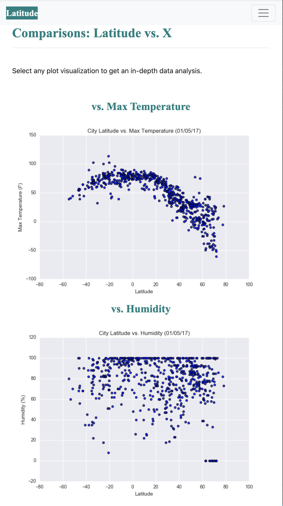
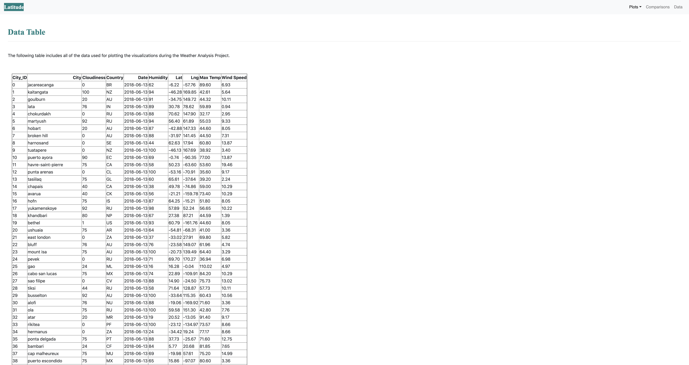
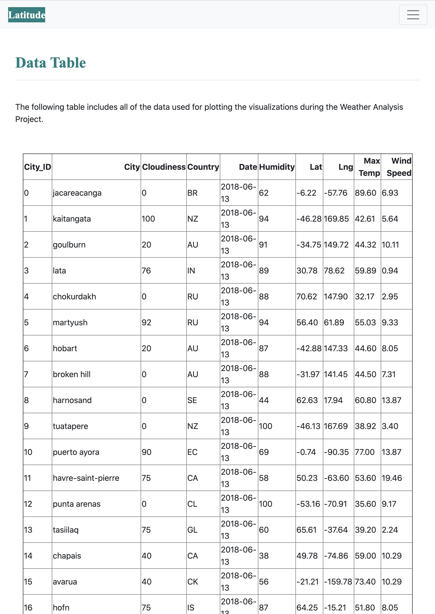
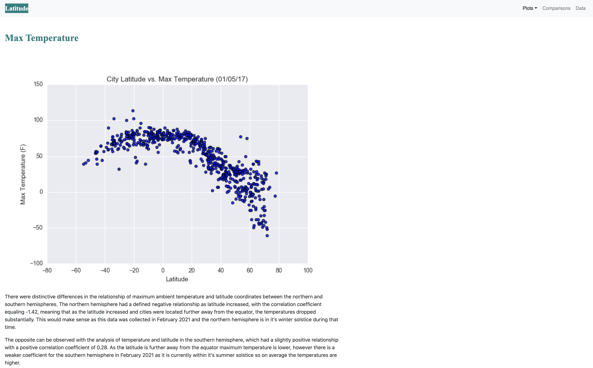
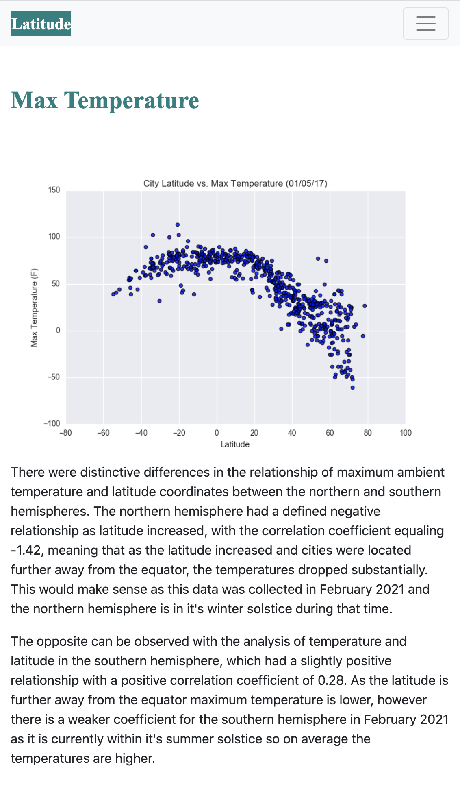
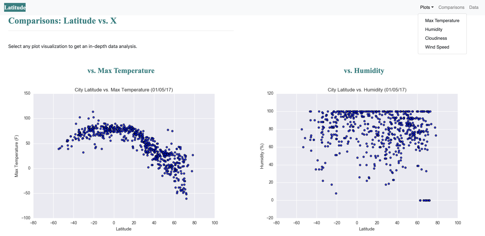

# Web Visualization Dashboard Summary: Latitude vs. Various Weather Conditions

## Background Information

For this project I created a visualization dashboard website using visualizations I've created in a previous project (**Geographical Weather Analysis**). The initial CSV for this project encompasses [weather data](Resources/cities.csv) factors such as maximum temperature, humidity, cloudiness, and wind speed.

In building this dashboard, I created individual pages for each plot and a dropdown menu to navigate between them. Each page contains the visualizations and their corresponding explanations trends within the data. I developed an intiial landing page which displays all of the plots for an overview comparison, and another page where we can view the data used to build them in a table format.

## Website Layout

The website contains **7 pages total**, including:

* A [landing page](#landing-page) containing:
  * An explanation of the project.
  * Links to each visualization page. There is a sidebar containing preview images of each plot, and clicking an image allows the user to navigate to that visualization.

* Four [visualization pages](#visualization-pages), each with:
  * A descriptive title and heading tag (Max Temperature, Humidity, Cloudiness, and Wind Speed).
  * The plot/visualization itself for the selected comparison.
  * A paragraph describing the plot and the significance of its data points.

* A ["Comparisons" page](#comparisons-page) that:
  * Contains all of the visualizations on the same page so that the user easily visually compare them.
  * I utilized a Bootstrap grid for the visualization layouts. Specifically, the Bootstrap grid is two visualizations acrros on screens medium and larger, and one visualization across on extra-small and small screens. Screenshots displaying the responsive layout of this Bootstrap grid are located at the end of this ReadME file.
  

* A ["Data" page](#data-page) that:
  * Displays a responsive table containing the data used in the visualizations.
    * This table utilizes a bootstrap table component, which is referenced in the `data_table.html` file.
    * The data was converted from a `.csv` to HTML using Pandas in a Jupyter Notebook. Once transformed into a Dataframe, the datetime dependency was used to convert the date structure and then dropped the timestamp.

## Website Navigation

In order to navigate across all 7 pages in the website, a navigation menu was developed at the top of every page that is capable of the following:

* Has the name of the site on the left of the nav which allows users to return to the landing page from any page.
* Contains a dropdown menu on the right of the navbar named "Plots" that provides a link to each individual visualization page.
* Provides two more text links on the right: "**Comparisons**," which links to the comparisons page, and "**Data**," which links to the data page.
* Is responsive (using CSS media queries). The nav has similar behavior as the screenshots ["Navigation Menu" section](#navigation-menu).

## Deployment

This website is available for access through my repositorty and is also deployed to GitHub pages for external use and observation.

## Screenshots

This section contains screenshots of each page I built, at varying screen widths to demonstrate the Bootstrap elements for responsive windows.

### Landing page

**Large screen:**

**Small screen:**



### Comparisons page

**Large screen:**

**Small screen:**

### Data page

**Large screen:**

**Small screen:**

### Visualization pages

* This is includes a screenshot of one singular visualization, but all four visualizations are formatted in the same layout. 

**Large screen:**

**Small screen:**

### Navigation menu

**Large screen:**

**Small screen:**

## Copyright

© 2021 Trilogy Education Services, LLC, a 2U, Inc. brand. Confidential and Proprietary. All Rights Reserved.
